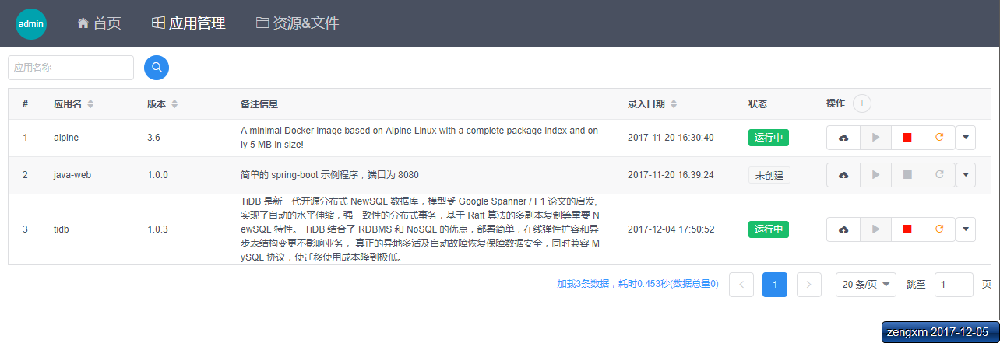
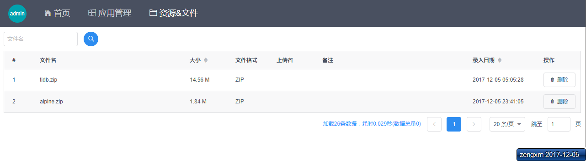

# buter-admin
> 此项目基于[vue-iview-starter](https://github.com/0604hx/vue-iview-starter)构建

[Buter](https://www.github.com/0604hx/buter) 系统的 UI 界面

## 界面预览

### 应用管理



### 资源&文件



## 如何使用

``` bash
# install dependencies
npm install

# serve with hot reload at localhost:8080
npm run dev

# build for production with minification
npm run build

# build for production and view the bundle analyzer report
npm run build --report
```

For a detailed explanation on how things work, check out the [guide](http://vuejs-templates.github.io/webpack/) and [docs for vue-loader](http://vuejs.github.io/vue-loader).
